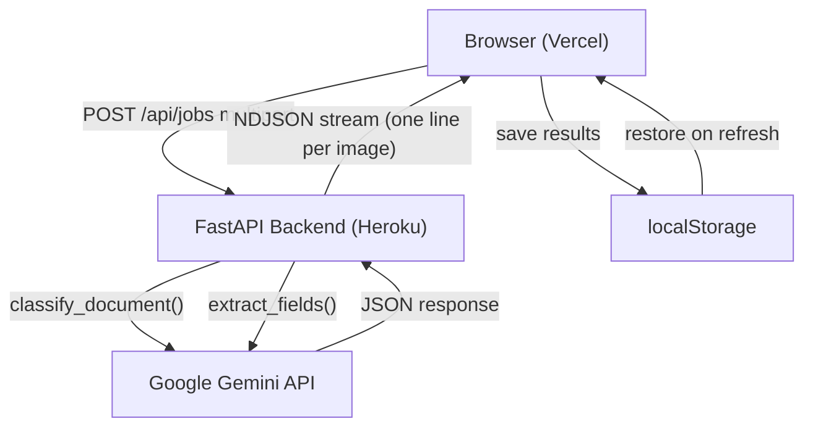
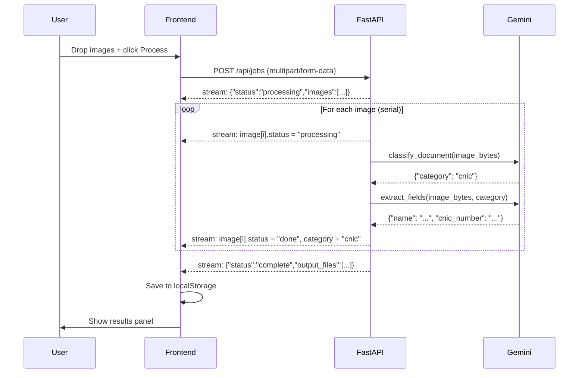
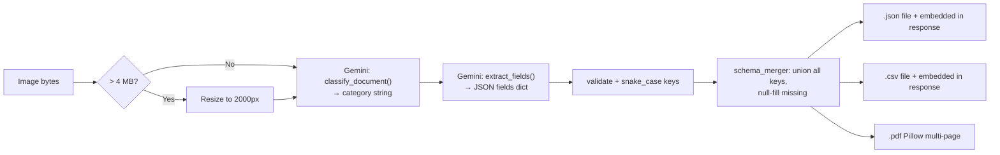

# Keenu IDP — Intelligent Document Processing

AI-powered document classification and data extraction for Keenu (Pakistan digital payments). Upload scanned images of CNICs, driving licences, invoices, receipts, resumes, and forms — get back structured JSON, CSV, and PDF outputs in seconds.

**Live demo:** [frontend-two-chi-91.vercel.app](https://frontend-two-chi-91.vercel.app)

---

## Features

- Classifies documents into 7 categories (CNIC, Driving Licence, Invoices, Receipts, Resumes, Forms, Other)
- Extracts structured fields using Google Gemini multimodal AI
- Streams live per-image progress to the browser as each document is processed
- Outputs per-category JSON, CSV (Excel-compatible), and PDF
- Sample image sidebar — demo without your own documents
- Drag-and-drop upload, up to 10 images per batch
- Results persist in browser `localStorage` across page refreshes

---

## Architecture



---

## Request / response flow



---

## Per-image pipeline



---

## Document categories & extracted fields

| Category | Emoji | Key fields extracted |
|---|---|---|
| `cnic` | 🪪 | name, cnic_number, date_of_birth, gender, issue_date, expiry_date |
| `driving_licence` | 🚗 | name, licence_number, dob, issue_date, expiry_date, blood_group, address |
| `invoices` | 🧾 | vendor_name, invoice_number, date, items[], subtotal, tax, total_amount |
| `receipt` | 🛒 | vendor_name, date, items[], subtotal, tax, total_amount, payment_method |
| `resumes` | 📄 | name, email, phone, skills[], education[], experience[], summary |
| `forms` | 📋 | all visible key-value pairs |
| `other` | 📁 | any visible structured information |

---

## Tech stack

| Layer | Technology |
|---|---|
| Frontend | React 18, Vite, CSS Modules |
| Backend | FastAPI (Python 3.11), Uvicorn |
| AI | Google Gemini `gemini-3.1-flash-lite-preview` |
| PDF generation | Pillow |
| Streaming | NDJSON over HTTP (`StreamingResponse`) |
| Frontend hosting | Vercel |
| Backend hosting | Heroku |

---

## Local development

### Prerequisites

- Python 3.11+
- Node.js 18+
- Google API key with Gemini access

### Backend

```bash
cd backend
python -m venv venv
source venv/bin/activate      # Windows: venv\Scripts\activate
pip install -r requirements.txt

# Create .env in project root
echo "GOOGLE_API_KEY=your-key-here" > ../.env

uvicorn app.main:app --reload --port 8000
```

### Frontend

```bash
cd frontend
npm install

# Create .env.local
echo "VITE_API_URL=http://localhost:8000" > .env.local

npm run dev
```

Open [http://localhost:5173](http://localhost:5173).

---

## Deployment

### Backend → Heroku

```bash
heroku create your-app-name
heroku config:set GOOGLE_API_KEY=your-key
heroku config:set ALLOWED_ORIGINS=https://your-frontend.vercel.app

# Push only backend/ subdir as Heroku root
git subtree push --prefix backend heroku main
```

### Frontend → Vercel

```bash
cd frontend
echo "https://your-app-name.herokuapp.com" | vercel env add VITE_API_URL production
vercel --prod
```

---

## Project structure

```
keenu_work/
├── backend/
│   ├── app/
│   │   ├── api/routes.py           # POST /api/jobs → StreamingResponse (NDJSON)
│   │   ├── models/schemas.py       # Pydantic models (JobState, OutputFile, …)
│   │   ├── services/
│   │   │   ├── gemini_service.py   # classify_document + extract_fields
│   │   │   ├── processor.py        # process_job_stream async generator
│   │   │   ├── output_generator.py # JSON / CSV / PDF writer
│   │   │   └── schema_merger.py    # key normalisation + schema union
│   │   ├── utils/
│   │   │   ├── logger.py
│   │   │   └── validators.py
│   │   ├── config.py
│   │   └── main.py                 # FastAPI app, CORS
│   ├── tests/
│   ├── Procfile
│   ├── runtime.txt
│   └── requirements.txt
├── frontend/
│   ├── public/samples/             # 30 sample images (5 per category)
│   ├── src/
│   │   ├── components/
│   │   │   ├── Header.jsx
│   │   │   ├── Footer.jsx          # GitHub link
│   │   │   ├── Sidebar.jsx         # Sample image browser
│   │   │   ├── FileUploader.jsx    # Drag-drop upload zone
│   │   │   ├── ProcessingStatus.jsx# Live per-image progress cards
│   │   │   └── OutputPanel.jsx     # Results grid (View / Download)
│   │   ├── data/samples.js         # Static sample image manifest
│   │   ├── services/api.js         # fetch-based NDJSON stream reader
│   │   ├── App.jsx                 # App shell + inline file viewer modal
│   │   └── main.jsx
│   ├── vercel.json
│   └── vite.config.js
├── dataset/                        # (gitignored) local test images
└── .env                            # (gitignored) GOOGLE_API_KEY
```

---

## Notes

- **NDJSON streaming**: backend writes one JSON line per state change; frontend reads with `ReadableStream` and updates React state incrementally, keeping the UI responsive during long jobs.
- **localStorage persistence**: when processing completes the full `JobState` (including embedded file content) is saved to `localStorage` and restored on page reload for up to 2 hours.
- **Heroku ephemeral filesystem**: output files on disk are cleared on dyno restart. JSON and CSV content is embedded in the response so View works regardless. PDF download links require the dyno to be alive.
- **Serial Gemini calls**: each image makes 2 sequential API calls (classify then extract) to avoid exhausting free-tier quota. Processing time is roughly 5–15 seconds per image.
- **10-image limit**: enforced on both frontend and backend.

---

*Made by [Danish](https://github.com/danisaysskol/keenu-idp)*
