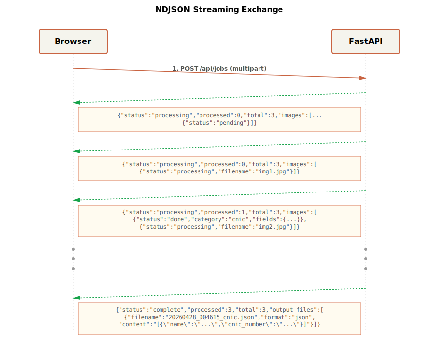

# Keenu IDP — Intelligent Document Processing

AI-powered document classification and data extraction for Keenu (Pakistan digital payments). Upload scanned images of CNICs, driving licences, invoices, receipts, resumes, and forms — get back structured JSON, CSV, and PDF outputs in seconds.

**Live demo:** [keenu-idp-danish.vercel.app](https://keenu-idp-danish.vercel.app)

> 🌍 **Public & Accessible Everywhere** — No login required. Try it from any device, anywhere in the world. Upload your own documents or use the sample images included in the sidebar.

---

## Problem Statement

Manual document processing for digital payment verification is **slow, error-prone, and doesn't scale**. Payment processors waste time on:
- Manually reviewing scanned documents (CNIC, driving licence, invoices, receipts)
- Extracting field values by hand into spreadsheets
- Re-entering data across multiple systems
- Dealing with poor image quality, OCR failures, and inconsistent formats

**Keenu IDP solves this** by using Google Gemini's multimodal AI to classify and extract structured data from document images in seconds, with 90%+ accuracy on typical document types.

---

## Use Cases

### 1. **KYC (Know Your Customer) Verification**
Upload a customer's CNIC image → extract name, ID number, DOB, expiry date → auto-populate KYC form → save to database

### 2. **Invoice Processing**
Scan 5 vendor invoices → extract vendor name, invoice number, items, subtotal, tax, total → generate CSV → import into accounting software

### 3. **Receipt Batch Processing**
Process 10 ATM/shop receipts at once → extract merchant, date, amount, payment method → create expense reports → flag duplicate/suspect transactions

### 4. **Resume Screening**
Upload job applicant resumes → extract name, skills, education, experience → populate candidate database → match against job requirements

### 5. **Form Digitisation**
Scan printed claim/application forms → extract all key-value pairs → auto-populate digital form → reduce data entry labour

---

## Features

✓ Classifies documents into 7 categories (CNIC, Driving Licence, Invoices, Receipts, Resumes, Forms, Other)
✓ Extracts structured fields using Google Gemini 3.1 multimodal AI
✓ **Live per-image progress streaming** — see each document status as it's processed
✓ Outputs per-category JSON, CSV (Excel-compatible), and PDF
✓ Sample image sidebar — demo without your own documents
✓ Drag-and-drop upload, up to 10 images per batch
✓ Results persist in browser `localStorage` across page refreshes

---

## Architecture

### System Components


### Data Flow (Per Image)


### Stream Message Format (NDJSON)

Browser sends multipart POST, backend streams one JSON line per state change:



---

## Document Categories & Extracted Fields

| Category | Emoji | Key fields extracted |
|---|---|---|
| `cnic` | 🪪 | name, cnic_number, date_of_birth, gender, issue_date, expiry_date |
| `driving_licence` | 🚗 | name, licence_number, dob, issue_date, expiry_date, blood_group, address |
| `invoices` | 🧾 | vendor_name, invoice_number, date, items[], subtotal, tax, total_amount |
| `receipt` | 🛒 | vendor_name, date, items[], subtotal, tax, total_amount, payment_method |
| `resumes` | 📄 | name, email, phone, skills[], education[], experience[], summary |
| `forms` | 📋 | all visible key-value pairs |
| `other` | 📁 | any visible structured information |

---

## Tech Stack

| Layer | Technology |
|---|---|
| Frontend | React 18, Vite, CSS Modules |
| Backend | FastAPI (Python 3.11), Uvicorn |
| AI | Google Gemini `gemini-3.1-flash-lite-preview` |
| Streaming | NDJSON over HTTP (`StreamingResponse`) |
| PDF generation | Pillow |
| Frontend hosting | Vercel |
| Backend hosting | Heroku |

---

## Local Development

### Prerequisites

- Python 3.11+
- Node.js 18+
- Google API key with Gemini access

### Backend

```bash
cd backend
python -m venv venv
source venv/bin/activate      # Windows: venv\Scripts\activate
pip install -r requirements.txt

# Create .env in project root
echo "GOOGLE_API_KEY=your-key-here" > ../.env

uvicorn app.main:app --reload --port 8000
```

### Frontend

```bash
cd frontend
npm install

# Create .env.local
echo "VITE_API_URL=http://localhost:8000" > .env.local

npm run dev
```

Open [http://localhost:5173](http://localhost:5173).

---

## Deployment

### Backend → Heroku

```bash
heroku create your-app-name
heroku config:set GOOGLE_API_KEY=your-key
heroku config:set ALLOWED_ORIGINS=https://your-frontend.vercel.app

# Push only backend/ subdir as Heroku root
git subtree push --prefix backend heroku main
```

### Frontend → Vercel

```bash
cd frontend
echo "https://your-app-name.herokuapp.com" | vercel env add VITE_API_URL production
vercel --prod
```

---

## Project Structure

```
keenu_work/
├── backend/
│   ├── app/
│   │   ├── api/routes.py           # POST /api/jobs → StreamingResponse (NDJSON)
│   │   ├── models/schemas.py       # Pydantic models
│   │   ├── services/
│   │   │   ├── gemini_service.py   # classify + extract via Gemini API
│   │   │   ├── processor.py        # async generator: process_job_stream
│   │   │   ├── output_generator.py # JSON / CSV / PDF writer
│   │   │   └── schema_merger.py    # key normalisation + schema union
│   │   ├── utils/
│   │   │   ├── logger.py
│   │   │   └── validators.py
│   │   ├── config.py
│   │   └── main.py                 # FastAPI app + CORS
│   ├── tests/
│   ├── Procfile
│   ├── runtime.txt
│   └── requirements.txt
├── frontend/
│   ├── public/samples/             # 30 sample images (5 per category)
│   ├── src/
│   │   ├── components/
│   │   │   ├── Header.jsx
│   │   │   ├── Footer.jsx
│   │   │   ├── Sidebar.jsx         # Sample image browser
│   │   │   ├── FileUploader.jsx    # Drag-drop upload
│   │   │   ├── ProcessingStatus.jsx# Live per-image progress cards
│   │   │   └── OutputPanel.jsx     # Results (View/Download)
│   │   ├── data/samples.js
│   │   ├── services/api.js         # NDJSON stream reader
│   │   ├── App.jsx                 # App shell + file viewer modal
│   │   └── main.jsx
│   ├── vercel.json
│   └── vite.config.js
├── dataset/                        # (gitignored)
└── .env                            # (gitignored)
```

---

## Implementation Notes

- **NDJSON streaming**: Backend yields one JSON line per significant state change; frontend reads with `ReadableStream.getReader()` and updates React state incrementally, keeping UI responsive.
- **localStorage persistence**: Final `JobState` (including embedded file content) is saved to localStorage when complete, restored on page reload for up to 2 hours.
- **Heroku ephemeral filesystem**: Files are cleared on dyno restart. JSON/CSV content is embedded in the response, so View works regardless. PDF downloads require the dyno to be alive.
- **Serial Gemini calls**: Each image makes 2 sequential API calls (classify then extract) to avoid quota exhaustion. ~5–15 seconds per image.
- **10-image limit**: Enforced on both frontend and backend.

---

*Made by [Danish](https://github.com/danisaysskol/keenu-idp)*
